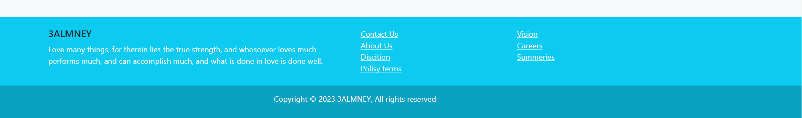

# Bootstrap-practice

### I have created a home page with the header , the main content and footer by using bootstrap .

### I used the following tools :-

* VS Code .
* HTML .
* Bootstrap classes (CSS framework).

### images of the home page :
+ The Header section  .
+ The Main section (Cards)  .
+ The Footer section  .
